## The question that guides the class

> **How does a computer turn numbers, images, and text into mathematical objects that an AI model can process?**

<div class="flow">
  <div class="box">Real-world data</div><div class="arrow">→</div>
  <div class="box">Numbers</div><div class="arrow">→</div>
  <div class="box">Tensores</div><div class="arrow">→</div>
  <div class="box">Operations</div><div class="arrow">→</div>
  <div class="box">AI model</div>
</div>

::: {.notes}
Do not start with formulas. Ask the group, ‘What does a computer see when we show it a photo?’ Guide them toward the idea of numerical representation.
:::

## Learning objectives

By the end, learners will be able to:

1. Identify **scalars, vectors, matrices, and tensors** in real-world data.
2. Interpret `shape`, `ndim`, batches, and channels.
3. Understand why matrix multiplication appears in neural networks.
4. Explain inverses, rank, norms, eigenvectors, SVD, and PCA intuitively.
5. Reproduce **each section from 2.1–2.12** in Google Colab.
6. Move tensors among **NumPy, TensorFlow, and PyTorch**, including CPU/GPU.

## Three-hour roadmap

::::: {.kpi-grid}

:::: {.kpi}
::: {.num}
45 min
:::
::: {.label}
2.1–2.4 · objects, products, inverse, span
:::
::::

:::: {.kpi}
::: {.num}
35 min
:::
::: {.label}
2.5–2.7 · norms, special matrices, eigen
:::
::::

:::: {.kpi}
::: {.num}
45 min
:::
::: {.label}
2.8–2.12 · SVD, pseudoinversa, traza, determinante, PCA
:::
::::

:::: {.kpi}
::: {.num}
35 min
:::
::: {.label}
Colab · datasets + frameworks + CPU/GPU
:::
::::

:::::

::: {.small .muted .center}
**+ 20 min** distribuidos en questions, transitions, and a short break.
:::

## 2.1 Scalars, vectors, matrices, and tensors

<div class="center">

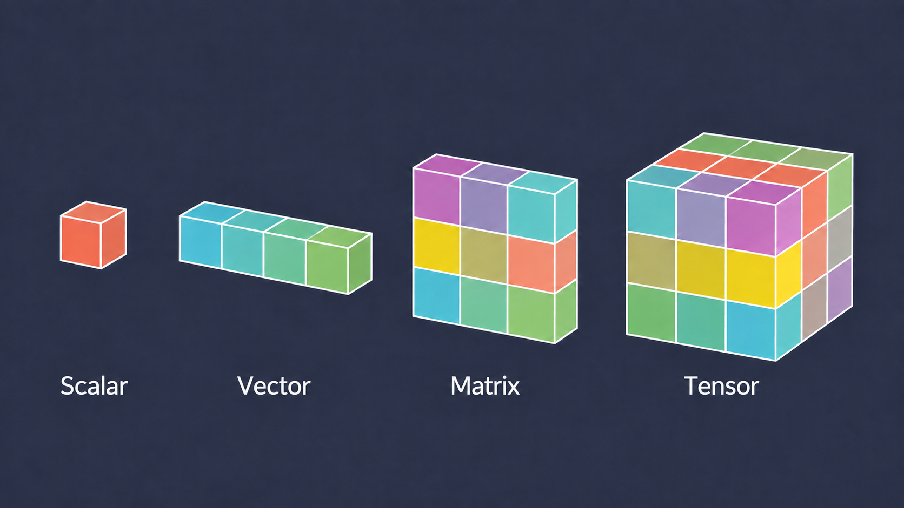{width="75%"}

</div>

## Scalars {.scalar-slide}

::: {.columns .scalar-layout}

::: {.column width="52%"}

<div class="scalar-heading">Scalars</div>
<div class="scalar-heading-line"></div>

::: {.scalar-text}

A **scalar** is the simplest form of data:
a single numerical or symbolic value. It can
represent a constant or a
univariate variable.

In machine learning, we usually
work with real-valued scalars:

$$
a \in \mathbb{R}
$$

::: {.scalar-points}

<div>
<span class="dot purple"></span>
<strong>Represents a single value</strong>
</div>

<div>
<span class="dot cyan"></span>
It has no dimensions or direction
</div>

<div>
<span class="dot yellow"></span>
It can be real or complex
</div>

:::

::: {.scalar-note}

Although they seem simple, scalars are
fundamental: many model hyperparameters,
such as learning rate $\lambda$, the
number of epochs, or a threshold, are often
expressed as scalar values.

:::

:::

:::

::: {.column width="48%"}

::: {.scalar-visual}

<div class="scalar-main">

<div class="cube-scene">
<div class="scalar-cube">
<div class="cube-face cube-front"></div>
<div class="cube-face cube-right"></div>
<div class="cube-face cube-top"></div>
</div>
</div>

<div class="scalar-number">5</div>

</div>

<div class="scalar-cards">

<div class="scalar-card card-purple">
<div class="card-icon">🌡️</div>
<div class="card-value">24°C</div>
</div>

<div class="scalar-card card-cyan">
<div class="card-symbol">λ</div>
<div class="card-value">= 0.01</div>
</div>

<div class="scalar-card card-yellow">
<div class="card-symbol">x</div>
<div class="card-value">= 3.5</div>
</div>

</div>

<div class="scalar-definition">
A <span>scalar</span> <strong>=</strong> one value
</div>

:::

:::

:::

## Vectors {.image-slide}

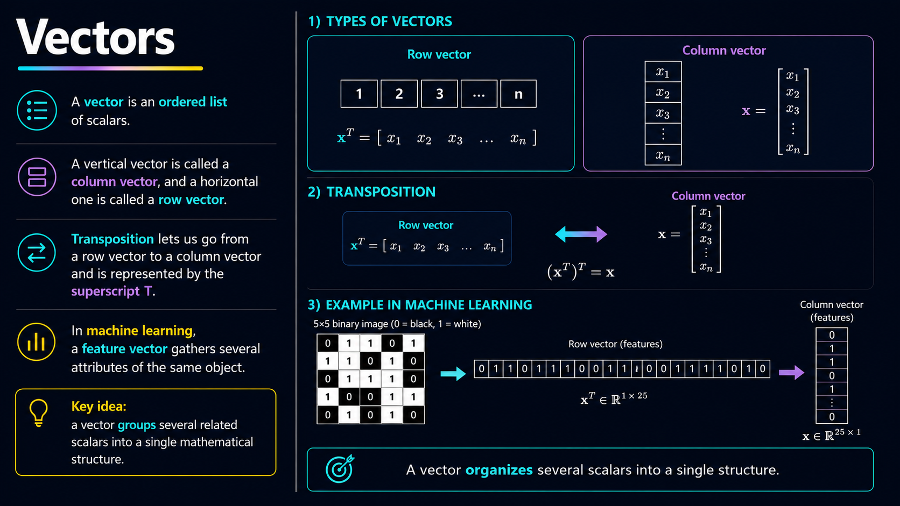{.vector-full-image}

## Matrices {.matrix-image-slide}

<div class="matrix-image-container">

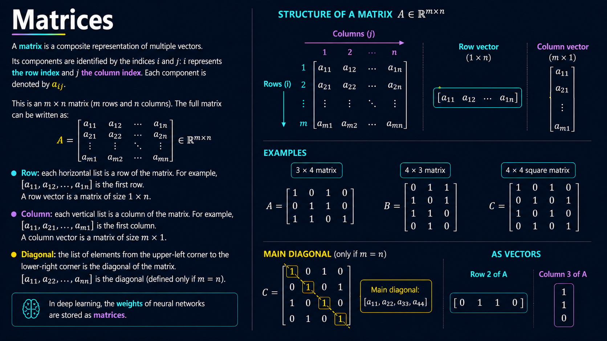

</div>

## Vectors {.vector-image-slide}

<div class="vector-image-container">


</div>

## Four objects, one idea

| Object | Simple explanation | Data example | Typical shape | Tensor dimension / rank |
|---|---|---|---|---|
| **Escalar** | one number | age | `()` | **Tensor 0D** |
| **Vector** | ordered list | one person | `(4,)` | **Tensor 1D** |
| **Matrix** | 2D table | 100 people × 4 variables | `(100, 4)` | **Tensor 2D** |
| **Tensor 3D** | array with 3 axes | RGB image | `(224, 224, 3)` | **Tensor 3D** |
| **Tensor 4D** | array with 4 axes | batch of RGB images | `(32, 224, 224, 3)` | **Tensor 4D** |
| **Tensor 5D** | array with 5 axes | batch of videos | `(8, 30, 224, 224, 3)` | **Tensor 5D** |
| **Tensor 6D** | array with 6 axes | batch of video sequences | `(4, 10, 30, 224, 224, 3)` | **Tensor 6D** |

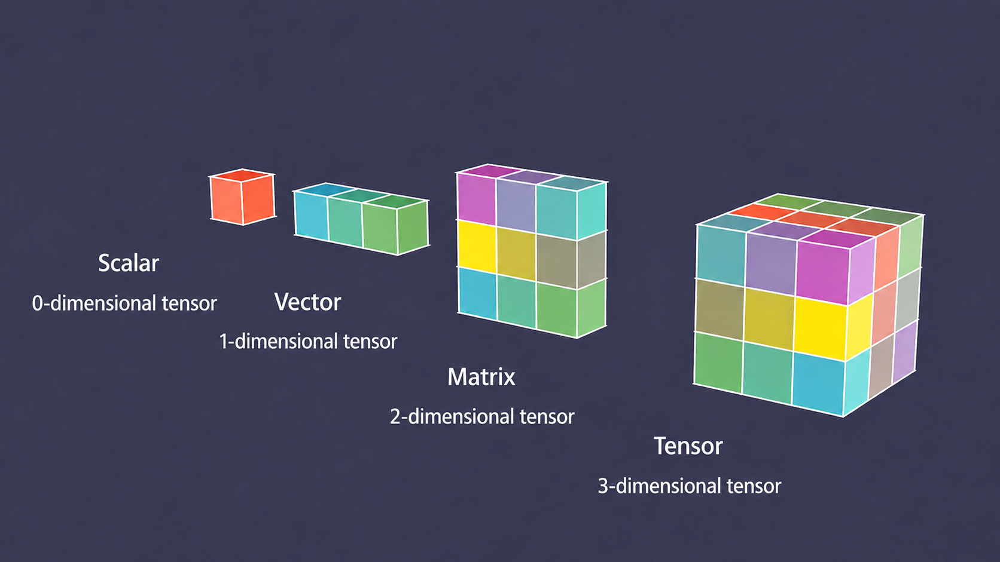{fig-align="center" width="55%"}

::: {.notes}
Avoid saying that tensor ‘always means 3D’.

In modern frameworks, tensor is the general term for n-dimensional arrays.

A scalar can be viewed as a rank-0 tensor.

Explain the progression:
- Escalar → tensor 0D
- Vector → tensor 1D
- Matrix → tensor 2D
- RGB image → tensor 3D
- Batch of images → tensor 4D
- Video → tensor 4D
- Lote de videos → tensor 5D
:::

## Broadcasting {.full-image-slide}

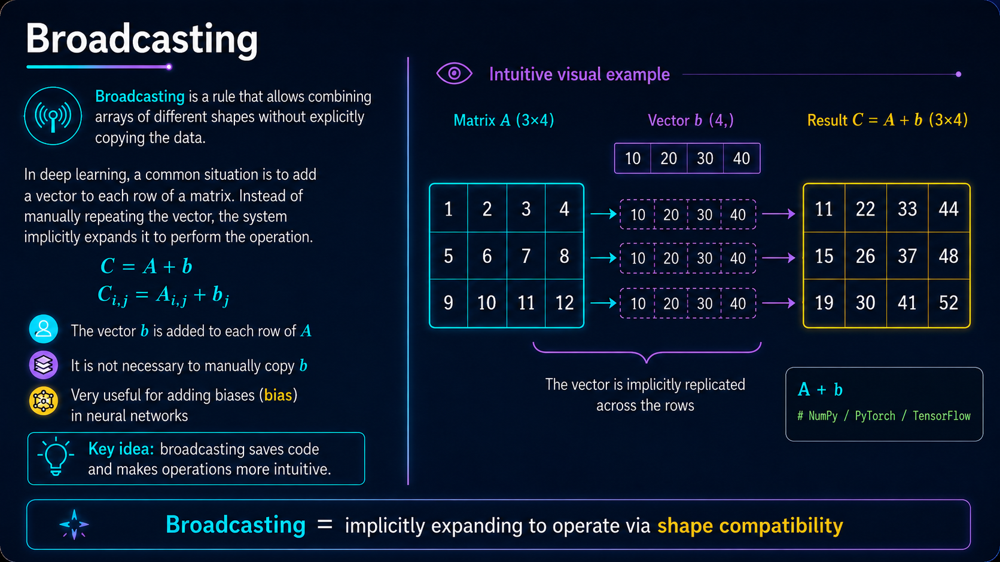

<div class="lab-button">[Open lab 2.1 in Colab](https://colab.research.google.com/github/Laverde97/linear-algebra-deep-learning/blob/main/en/exercises/01_scalars_vectors_matrices_tensors.ipynb)</div>


## 2.2 Matrix and Vector Multiplication {.full-image-slide}

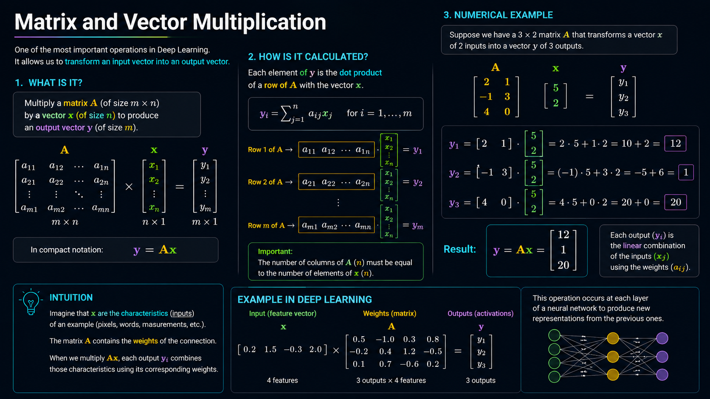

<div class="lab-button">[Open lab 2.2](https://colab.research.google.com/github/Laverde97/linear-algebra-deep-learning/blob/main/en/exercises/02_multiplying_matrices_vectors.ipynb)</div>

## 2.3 Identity and Inverse Matrices {.full-image-slide}

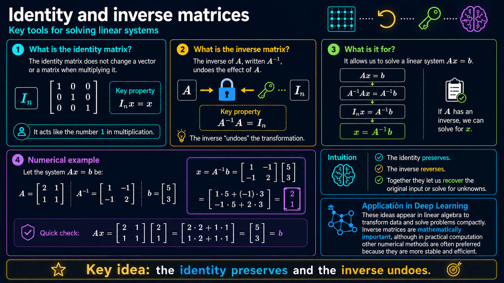

<div class="lab-button">[Open lab 2.3](https://colab.research.google.com/github/Laverde97/linear-algebra-deep-learning/blob/main/en/exercises/03_identity_inverse_matrices.ipynb)</div>

## 2.4 Linear Dependence and Span {.full-image-slide}

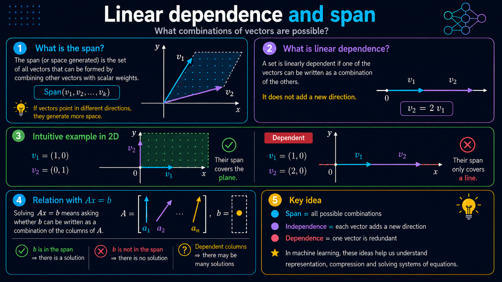

<div class="lab-button">[Open lab 2.4](https://colab.research.google.com/github/Laverde97/linear-algebra-deep-learning/blob/main/en/exercises/04_linear_dependence_span.ipynb)</div>

## 2.5 Normas {.full-image-slide}

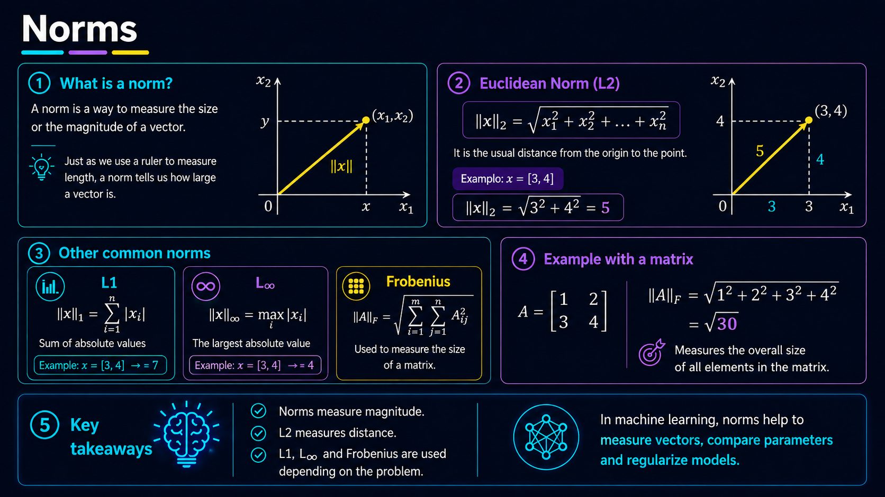

<div class="lab-button">[Open lab 2.5](https://colab.research.google.com/github/Laverde97/linear-algebra-deep-learning/blob/main/en/exercises/05_norms.ipynb)</div>

## 2.6 Special Types of Matrices and Vectors {.full-image-slide}

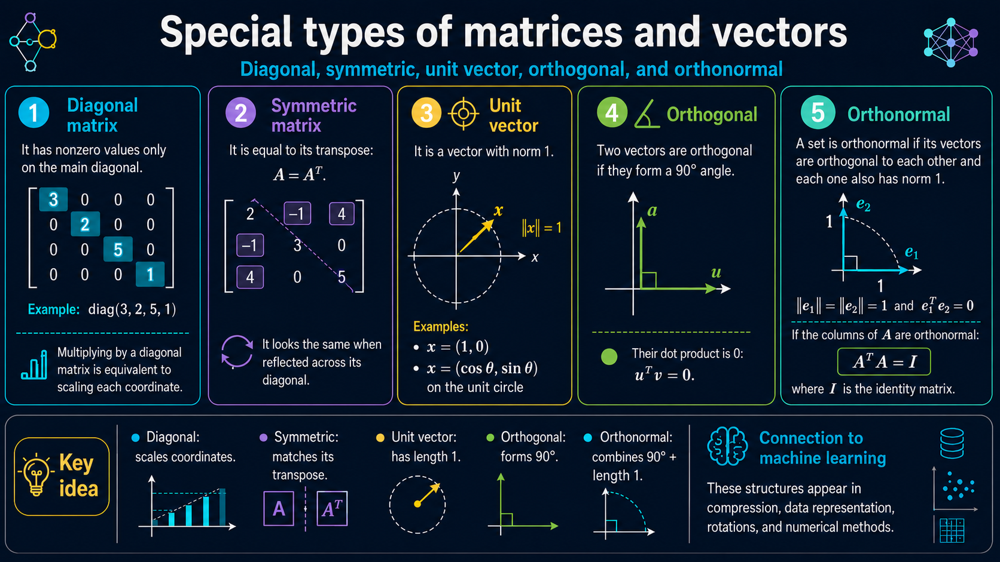

<div class="lab-button">[Open lab 2.6](https://colab.research.google.com/github/Laverde97/linear-algebra-deep-learning/blob/main/en/exercises/06_special_matrices_vectors.ipynb)</div>

## 2.7 Eigendecomposition (Eigendecomposition) {.full-image-slide}

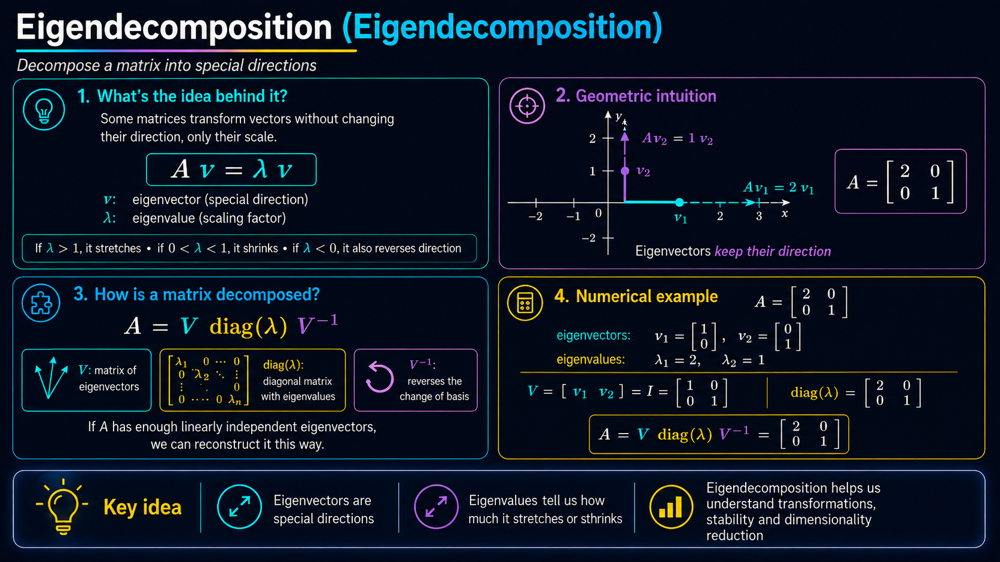

<div class="lab-button">[Open lab 2.7](https://colab.research.google.com/github/Laverde97/linear-algebra-deep-learning/blob/main/en/exercises/07_eigendecomposition.ipynb)</div>

## 2.8 Singular Value Decomposition (SVD) {.full-image-slide}

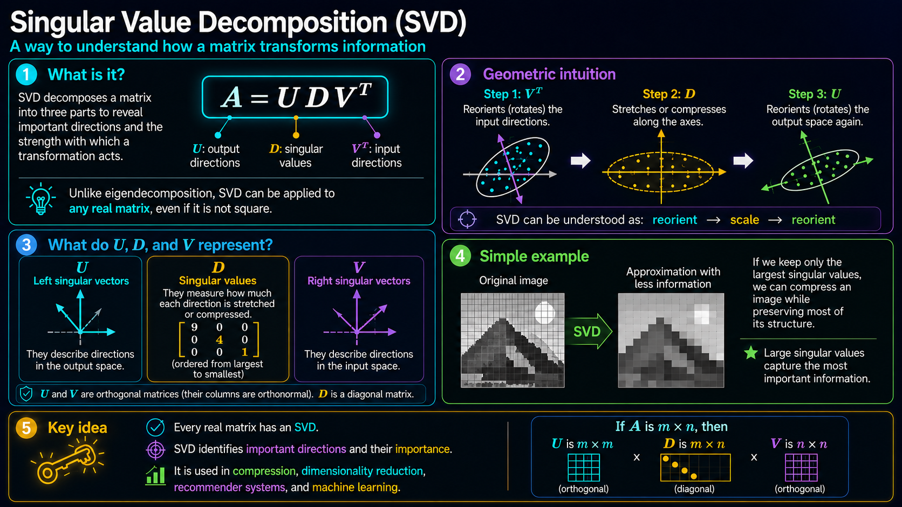

<div class="lab-button">[Open lab 2.8](https://colab.research.google.com/github/Laverde97/linear-algebra-deep-learning/blob/main/en/exercises/08_svd.ipynb)</div>

## 2.9 Moore–Penrose Pseudoinverse {.full-image-slide}

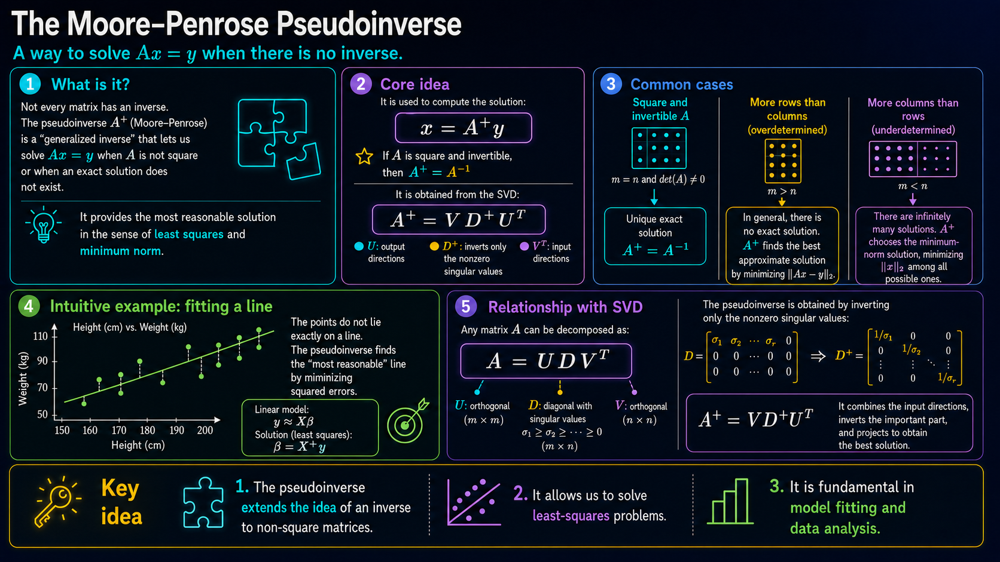

<div class="lab-button">[Open lab 2.9](https://colab.research.google.com/github/Laverde97/linear-algebra-deep-learning/blob/main/en/exercises/09_pseudoinverse.ipynb)</div>

## 2.10 The Trace Operator (Trace Operator) {.full-image-slide}

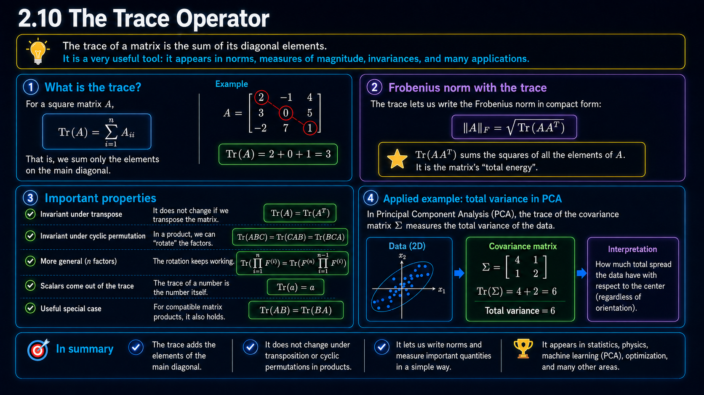

<div class="lab-button">[Open lab 2.10](https://colab.research.google.com/github/Laverde97/linear-algebra-deep-learning/blob/main/en/exercises/10_trace_operator.ipynb)</div>

## 2.11 Determinant {.full-image-slide}
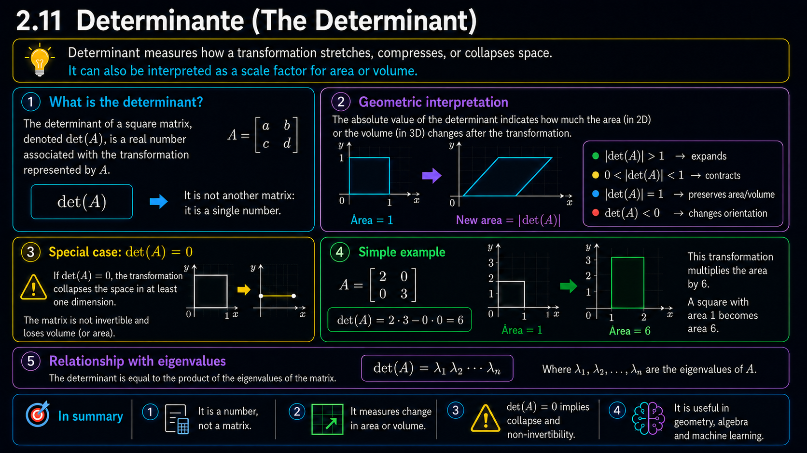

<div class="lab-button">[Open lab 2.11](https://colab.research.google.com/github/Laverde97/linear-algebra-deep-learning/blob/main/en/exercises/11_determinant.ipynb)</div>

## 2.12 Example: Principal Components Analysis (PCA) {.full-image-slide}

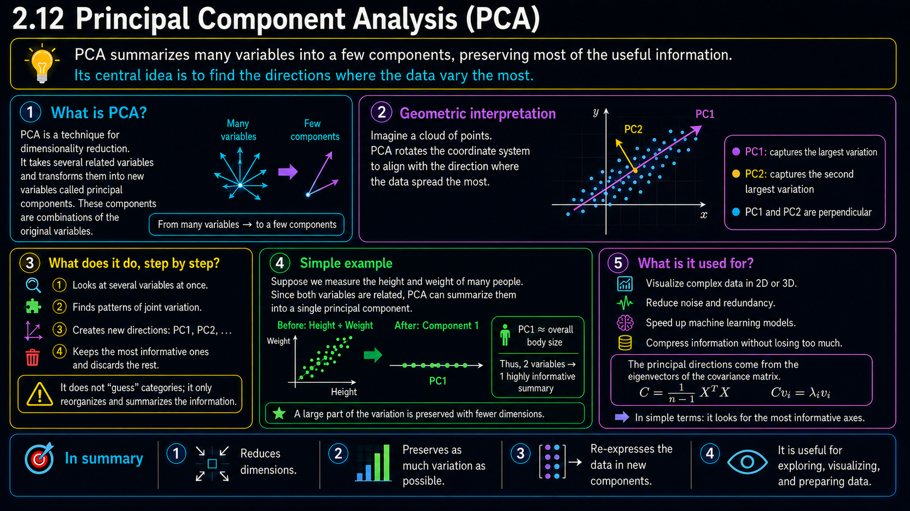

<div class="lab-button">[Open lab 2.12](https://colab.research.google.com/github/Laverde97/linear-algebra-deep-learning/blob/main/en/exercises/12_pca.ipynb)</div>

## The algebra stays the same; where it runs changes

```text
               same operation
                    A @ B
                      │
        ┌─────────────┼─────────────┐
        ↓             ↓             ↓
      NumPy      TensorFlow      PyTorch
       CPU        CPU / GPU       CPU / GPU
```
## Repository and labs

**Structure prepared for GitHub Pages:**

```text
linear-algebra-deep-learning/
├── en/
│   ├── slides/
│   └── exercises/
├── es/
│   ├── slides/
│   └── exercises/
├── shared/
├── _quarto.yml
└── .github/workflows/publish.yml
```

Expected URL:

`https://laverde97.github.io/linear-algebra-deep-learning/`

## Sources and credits {.smaller}

- Goodfellow, I., Bengio, Y. & Courville, A. **Deep Learning**, Chapter 2: Linear Algebra. MIT Press. https://www.deeplearningbook.org/contents/linear_algebra.html
- Quarto RevealJS documentation: https://quarto.org/docs/presentations/revealjs/
- Quarto GitHub Pages publishing: https://quarto.org/docs/publishing/github-pages.html
- MNIST via TensorFlow/Keras.
- IMDB Reviews via TensorFlow/Keras.
- ImageNet-v2 documentation via TensorFlow Datasets; for the live class the notebook uses a lightweight ImageNet-format demonstration and leaves ImageNet-v2 as optional due to download size.

<div class="small muted">Original teaching content based on the chapter concepts; it does not reproduce the full text of the book.</div>

## Key takeaway

> **Deep learning works with representations. Linear algebra gives us the language to describe, transform, measure, and compress them.**

<div class="flow">
<div class="box">Understand</div><div class="arrow">→</div>
<div class="box">Run</div><div class="arrow">→</div>
<div class="box">Visualize</div><div class="arrow">→</div>
<div class="box">Connect to AI</div>
</div>
