## La pregunta que guía la clase

> **¿Cómo convierte una computadora números, imágenes y texto en objetos matemáticos que puede procesar un modelo de IA?**

<div class="flow">
  <div class="box">Datos reales</div><div class="arrow">→</div>
  <div class="box">Números</div><div class="arrow">→</div>
  <div class="box">Tensores</div><div class="arrow">→</div>
  <div class="box">Operaciones</div><div class="arrow">→</div>
  <div class="box">Modelo de IA</div>
</div>

::: {.notes}
No comenzar con fórmulas. Preguntar al grupo: “¿Qué ve una computadora cuando le mostramos una foto?”. Llevarlos a la idea de representación numérica.
:::

## Objetivos de aprendizaje

Al terminar, el grupo podrá:

1. Reconocer **escalar, vector, matriz y tensor** a partir de datos reales.
2. Interpretar `shape`, `ndim`, batch y canales.
3. Entender por qué la multiplicación matricial aparece en redes neuronales.
4. Explicar de forma intuitiva inversa, rango, normas, autovectores, SVD y PCA.
5. Replicar **cada apartado 2.1–2.12** en Google Colab.
6. Mover tensores entre **NumPy, TensorFlow y PyTorch**, incluyendo CPU/GPU.

## Ruta de 3 horas

::::: {.kpi-grid}

:::: {.kpi}
::: {.num}
45 min
:::
::: {.label}
2.1–2.4 · objetos, productos, inversa, span
:::
::::

:::: {.kpi}
::: {.num}
35 min
:::
::: {.label}
2.5–2.7 · normas, matrices especiales, eigen
:::
::::

:::: {.kpi}
::: {.num}
45 min
:::
::: {.label}
2.8–2.12 · SVD, pseudoinversa, traza, determinante, PCA
:::
::::

:::: {.kpi}
::: {.num}
35 min
:::
::: {.label}
Colab · datasets + frameworks + CPU/GPU
:::
::::

:::::

::: {.small .muted .center}
**+ 20 min** distribuidos en preguntas, transiciones y una pausa corta.
:::

## 2.1 Escalares, vectores, matrices y tensores

<div class="center">

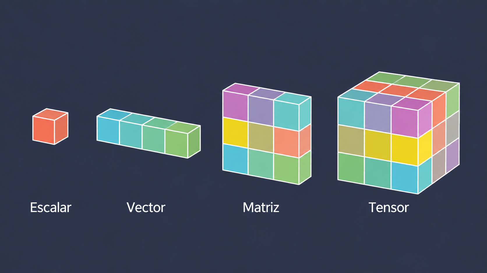{width="75%"}

</div>

## Escalares {.scalar-slide}

::: {.columns .scalar-layout}

::: {.column width="52%"}

<div class="scalar-heading">Escalares</div>
<div class="scalar-heading-line"></div>

::: {.scalar-text}

Un **escalar** es la forma más simple de dato:  
un único valor numérico o simbólico. Puede  
representar una constante o una variable  
univariante.

En aprendizaje automático, normalmente  
trabajamos con escalares reales:  

$$
a \in \mathbb{R}
$$

::: {.scalar-points}

<div>
<span class="dot purple"></span>
<strong>Representa un solo valor</strong>
</div>

<div>
<span class="dot cyan"></span>
No tiene dimensiones ni dirección
</div>

<div>
<span class="dot yellow"></span>
Puede ser real o complejo
</div>

:::

::: {.scalar-note}

Aunque parecen simples, los escalares son  
fundamentales: muchos hiperparámetros de  
un modelo, como la tasa de aprendizaje $\lambda$, el  
número de épocas o un umbral, suelen  
expresarse como valores escalares.

:::

:::

:::

::: {.column width="48%"}

::: {.scalar-visual}

<div class="scalar-main">

<div class="cube-scene">
<div class="scalar-cube">
<div class="cube-face cube-front"></div>
<div class="cube-face cube-right"></div>
<div class="cube-face cube-top"></div>
</div>
</div>

<div class="scalar-number">5</div>

</div>

<div class="scalar-cards">

<div class="scalar-card card-purple">
<div class="card-icon">🌡️</div>
<div class="card-value">24°C</div>
</div>

<div class="scalar-card card-cyan">
<div class="card-symbol">λ</div>
<div class="card-value">= 0.01</div>
</div>

<div class="scalar-card card-yellow">
<div class="card-symbol">x</div>
<div class="card-value">= 3.5</div>
</div>

</div>

<div class="scalar-definition">
Un <span>escalar</span> <strong>=</strong> un solo valor
</div>

:::

:::

:::

## Vectores {.image-slide}

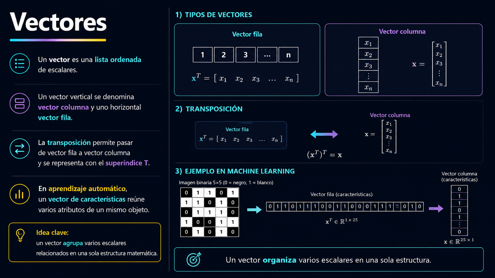{.vector-full-image}

## Matrices {.matrix-image-slide}

<div class="matrix-image-container">

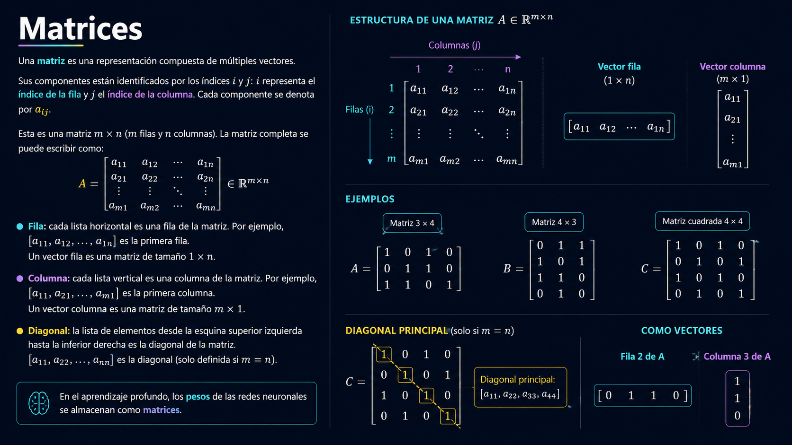

</div>

## Vectores {.vector-image-slide}

<div class="vector-image-container">


</div>

## Cuatro objetos, una misma idea

| Objeto | Explicación simple | Ejemplo de datos | Shape típica | Dimensión / rango del tensor |
|---|---|---|---|---|
| **Escalar** | un número | edad | `()` | **Tensor 0D** |
| **Vector** | lista ordenada | una persona | `(4,)` | **Tensor 1D** |
| **Matriz** | tabla 2D | 100 personas × 4 variables | `(100, 4)` | **Tensor 2D** |
| **Tensor 3D** | arreglo con 3 ejes | imagen RGB | `(224, 224, 3)` | **Tensor 3D** |
| **Tensor 4D** | arreglo con 4 ejes | lote de imágenes RGB | `(32, 224, 224, 3)` | **Tensor 4D** |
| **Tensor 5D** | arreglo con 5 ejes | lote de videos | `(8, 30, 224, 224, 3)` | **Tensor 5D** |
| **Tensor 6D** | arreglo con 6 ejes | lote de secuencias de video | `(4, 10, 30, 224, 224, 3)` | **Tensor 6D** |

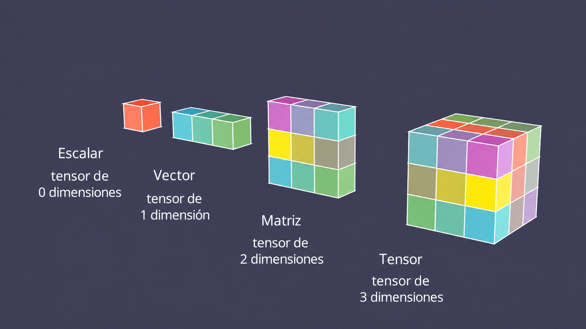{fig-align="center" width="55%"}

::: {.notes}
Evitar decir que tensor “siempre significa 3D”.

En frameworks modernos, tensor es el término general para arreglos n-dimensionales.

Un escalar puede verse como un tensor de rango 0.

Explicar la progresión:
- Escalar → tensor 0D
- Vector → tensor 1D
- Matriz → tensor 2D
- Imagen RGB → tensor 3D
- Lote de imágenes → tensor 4D
- Video → tensor 4D
- Lote de videos → tensor 5D
:::

## Broadcasting {.full-image-slide}

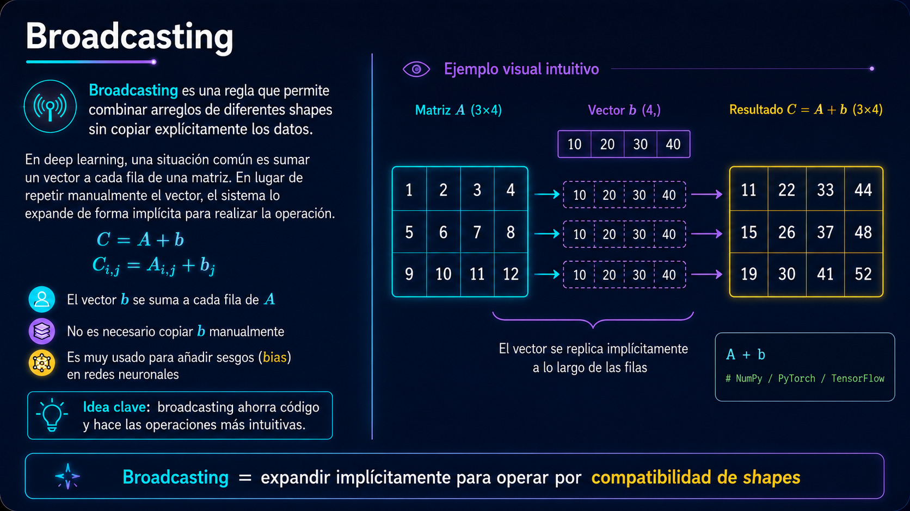

<div class="lab-button">[Abrir laboratorio 2.1 en Colab](https://colab.research.google.com/github/Laverde97/linear-algebra-deep-learning/blob/main/notebooks/01_scalars_vectors_matrices_tensors.ipynb)</div>


## 2.2 Multiplicación de Matrices y Vectores {.full-image-slide}

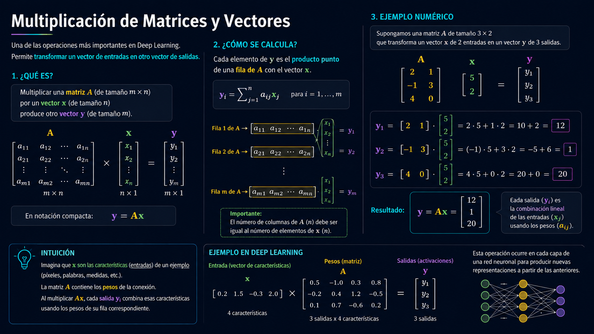

<div class="lab-button">[Abrir laboratorio 2.2](https://colab.research.google.com/github/Laverde97/linear-algebra-deep-learning/blob/main/notebooks/02_multiplying_matrices_vectors.ipynb)</div>

## 2.3 Matrices identidad e inversa {.full-image-slide}

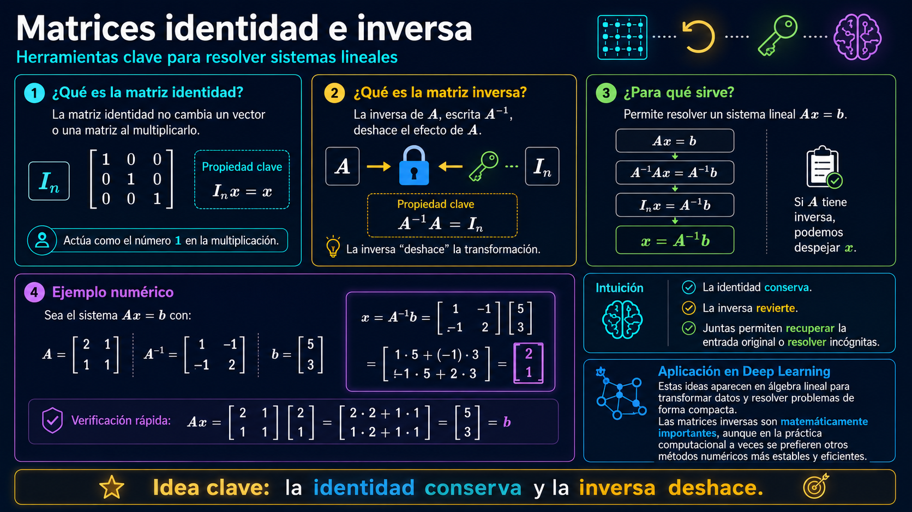

<div class="lab-button">[Abrir laboratorio 2.3](https://colab.research.google.com/github/Laverde97/linear-algebra-deep-learning/blob/main/notebooks/03_identity_inverse_matrices.ipynb)</div>

## 2.4 Dependencia lineal y span {.full-image-slide}

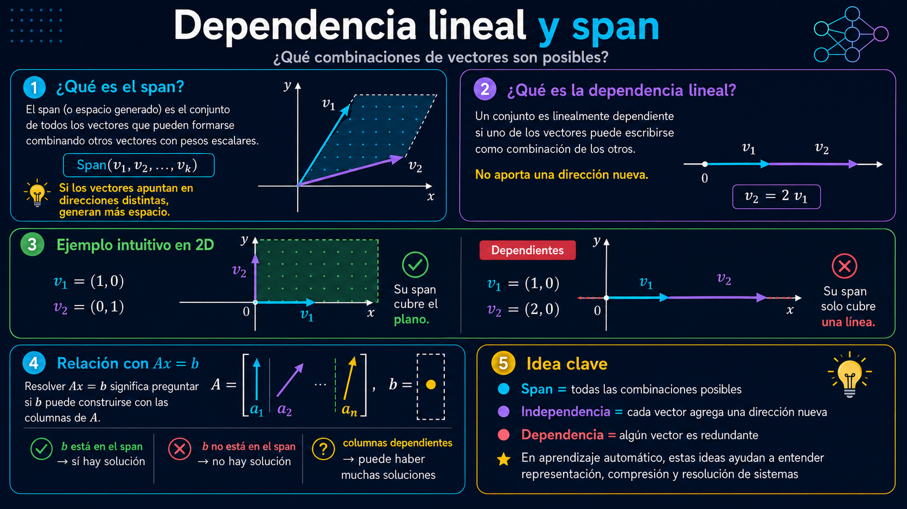

<div class="lab-button">[Abrir laboratorio 2.4](https://colab.research.google.com/github/Laverde97/linear-algebra-deep-learning/blob/main/notebooks/04_linear_dependence_span.ipynb)</div>

## 2.5 Normas {.full-image-slide}

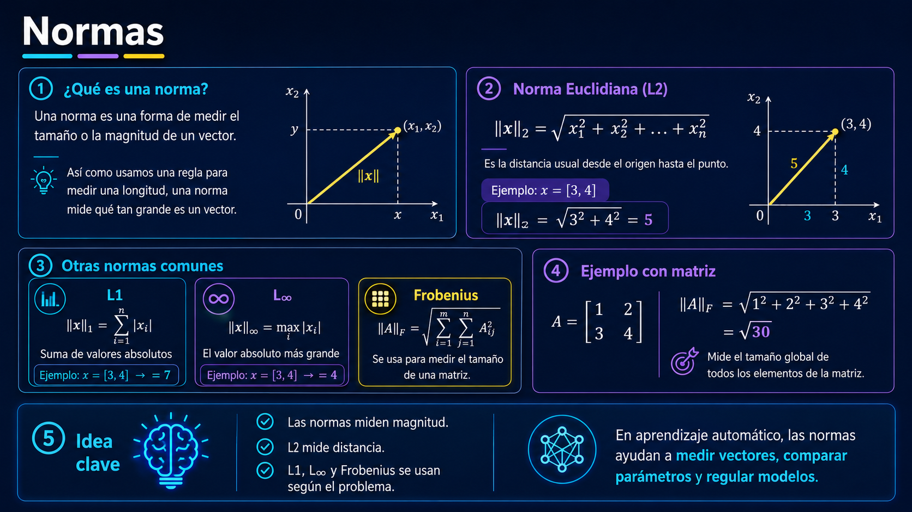

<div class="lab-button">[Abrir laboratorio 2.5](https://colab.research.google.com/github/Laverde97/linear-algebra-deep-learning/blob/main/notebooks/05_norms.ipynb)</div>

## 2.6 Tipos especiales de matrices y vectores {.full-image-slide}

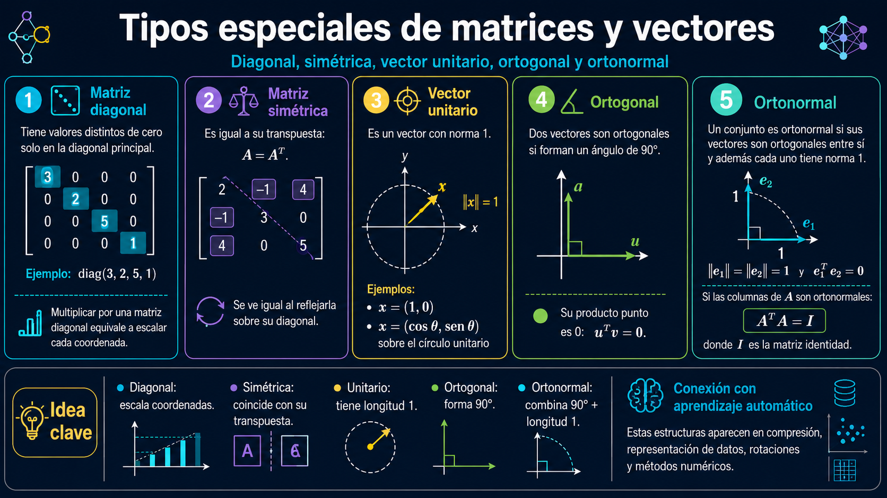

<div class="lab-button">[Abrir laboratorio 2.6](https://colab.research.google.com/github/Laverde97/linear-algebra-deep-learning/blob/main/notebooks/06_special_matrices_vectors.ipynb)</div>

## 2.7 Descomposición en autovalores (Eigendecomposition) {.full-image-slide}

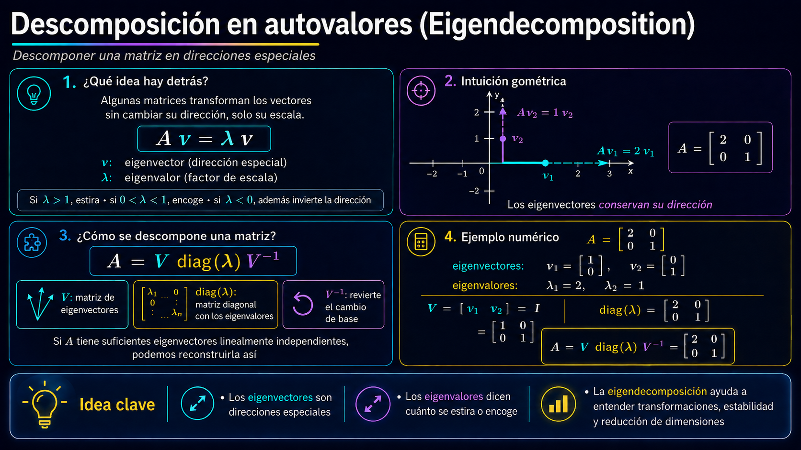

<div class="lab-button">[Abrir laboratorio 2.7](https://colab.research.google.com/github/Laverde97/linear-algebra-deep-learning/blob/main/notebooks/07_eigendecomposition.ipynb)</div>

## 2.8 Descomposición en valores singulares (SVD) {.full-image-slide}

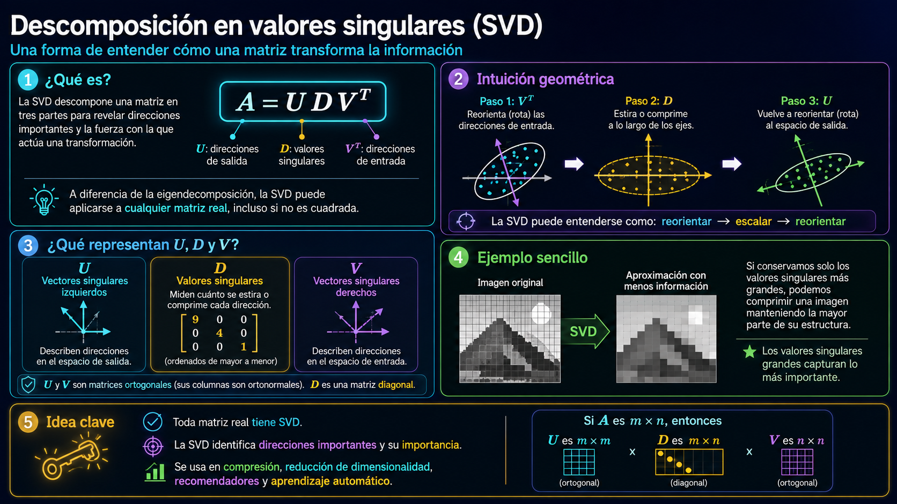

<div class="lab-button">[Abrir laboratorio 2.8](https://colab.research.google.com/github/Laverde97/linear-algebra-deep-learning/blob/main/notebooks/08_svd.ipynb)</div>

## 2.9 Pseudoinversa de Moore–Penrose {.full-image-slide}

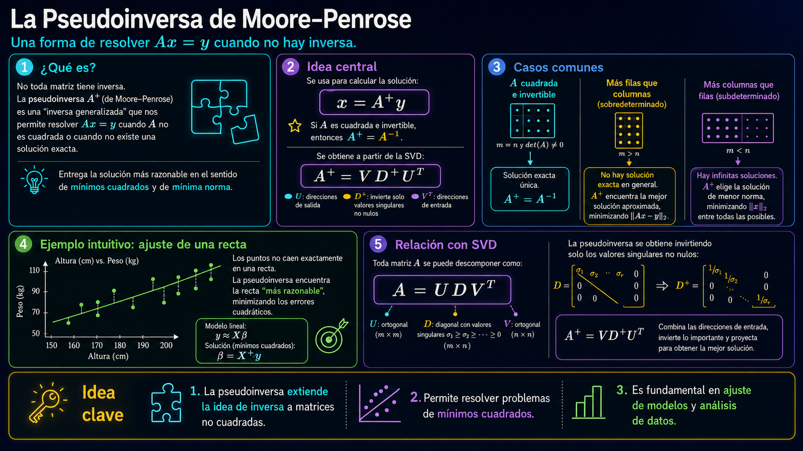

<div class="lab-button">[Abrir laboratorio 2.9](https://colab.research.google.com/github/Laverde97/linear-algebra-deep-learning/blob/main/notebooks/09_pseudoinverse.ipynb)</div>

## 2.10 El Operador Traza (Trace Operator) {.full-image-slide}

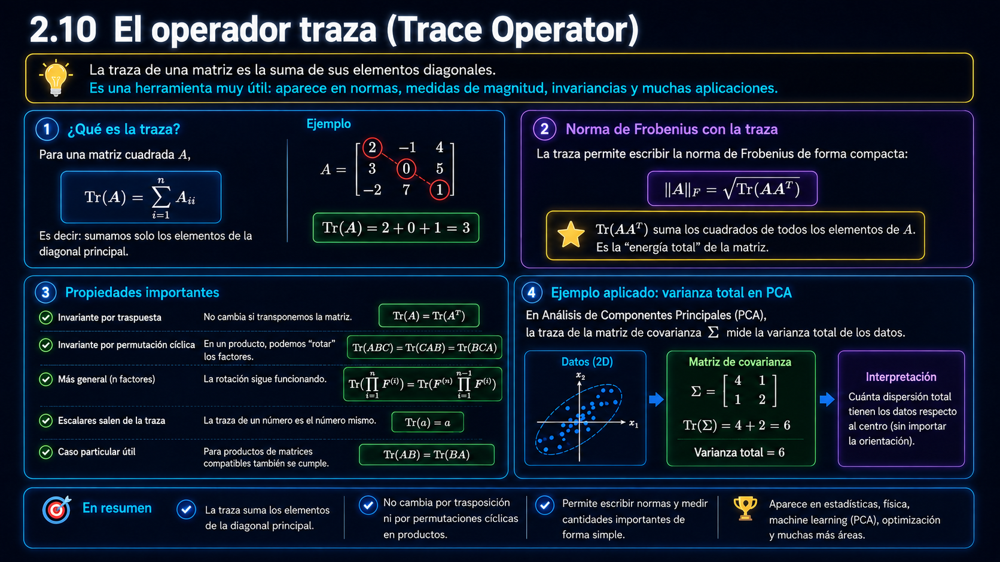

<div class="lab-button">[Abrir laboratorio 2.10](https://colab.research.google.com/github/Laverde97/linear-algebra-deep-learning/blob/main/notebooks/10_trace_operator.ipynb)</div>

## 2.11 Determinante {.full-image-slide}
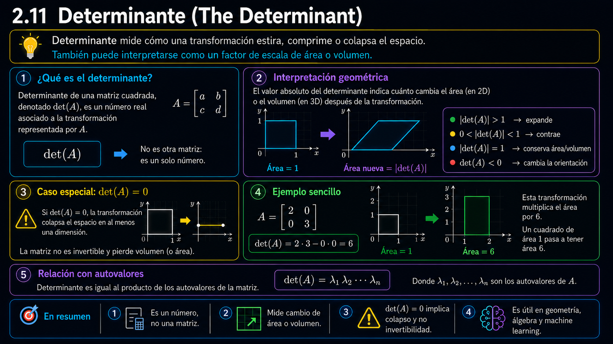

<div class="lab-button">[Abrir laboratorio 2.11](https://colab.research.google.com/github/Laverde97/linear-algebra-deep-learning/blob/main/notebooks/11_determinant.ipynb)</div>

## 2.12 Ejemplo: Principal Components Analysis (PCA) {.full-image-slide}

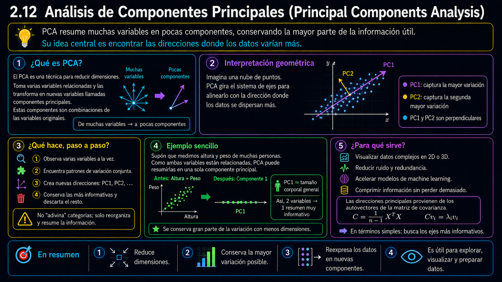

<div class="lab-button">[Abrir laboratorio 2.12](https://colab.research.google.com/github/Laverde97/linear-algebra-deep-learning/blob/main/notebooks/12_pca.ipynb)</div>

## El álgebra no cambia; cambia dónde se ejecuta

```text
               misma operación
                    A @ B
                      │
        ┌─────────────┼─────────────┐
        ↓             ↓             ↓
      NumPy      TensorFlow      PyTorch
       CPU        CPU / GPU       CPU / GPU
```
## Repositorio y laboratorios

**Estructura preparada para GitHub Pages:**

```text
linear-algebra-deep-learning/
├── index.qmd
├── styles.scss
├── _quarto.yml
├── notebooks/
│   ├── 01_scalars_vectors_matrices_tensors.ipynb
│   ├── ...
│   └── 13_cpu_gpu_frameworks.ipynb
└── .github/workflows/publish.yml
```

URL prevista:

`https://laverde97.github.io/linear-algebra-deep-learning/`

## Fuentes y créditos {.smaller}

- Goodfellow, I., Bengio, Y. & Courville, A. **Deep Learning**, Chapter 2: Linear Algebra. MIT Press. https://www.deeplearningbook.org/contents/linear_algebra.html
- Quarto RevealJS documentation: https://quarto.org/docs/presentations/revealjs/
- Quarto GitHub Pages publishing: https://quarto.org/docs/publishing/github-pages.html
- MNIST via TensorFlow/Keras.
- IMDB Reviews via TensorFlow/Keras.
- ImageNet-v2 documentation via TensorFlow Datasets; for the live class the notebook uses a lightweight ImageNet-format demonstration and leaves ImageNet-v2 as optional due to download size.

<div class="small muted">Contenido pedagógico original basado en los conceptos del capítulo; no reproduce el texto completo del libro.</div>

## La idea para llevarse

> **Deep learning trabaja con representaciones. El álgebra lineal nos da el lenguaje para describirlas, transformarlas, medirlas y comprimirlas.**

<div class="flow">
<div class="box">Entender</div><div class="arrow">→</div>
<div class="box">Ejecutar</div><div class="arrow">→</div>
<div class="box">Visualizar</div><div class="arrow">→</div>
<div class="box">Conectar con IA</div>
</div>